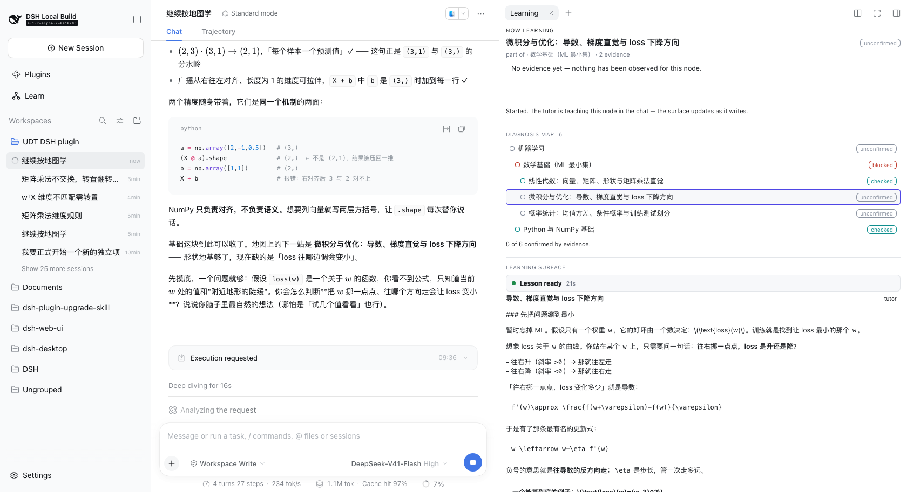
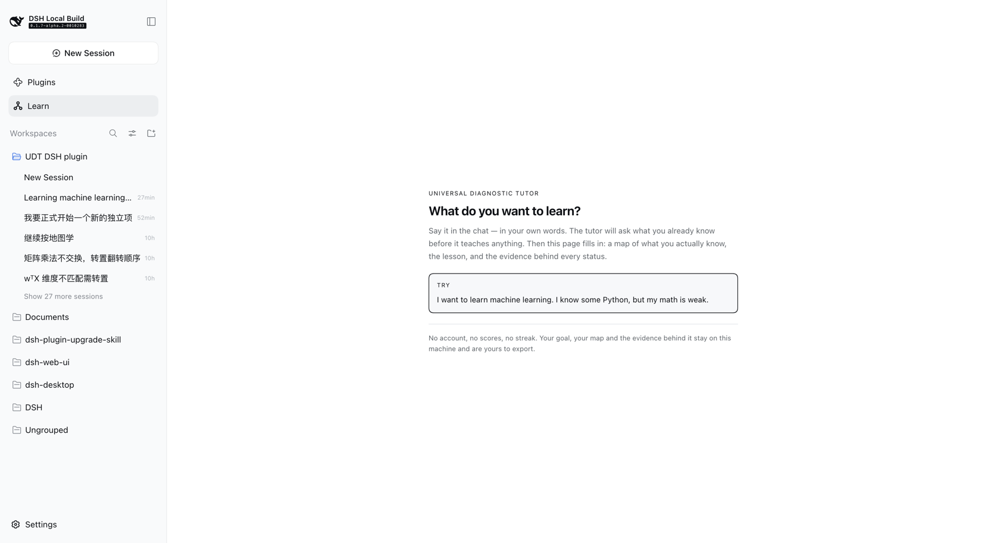
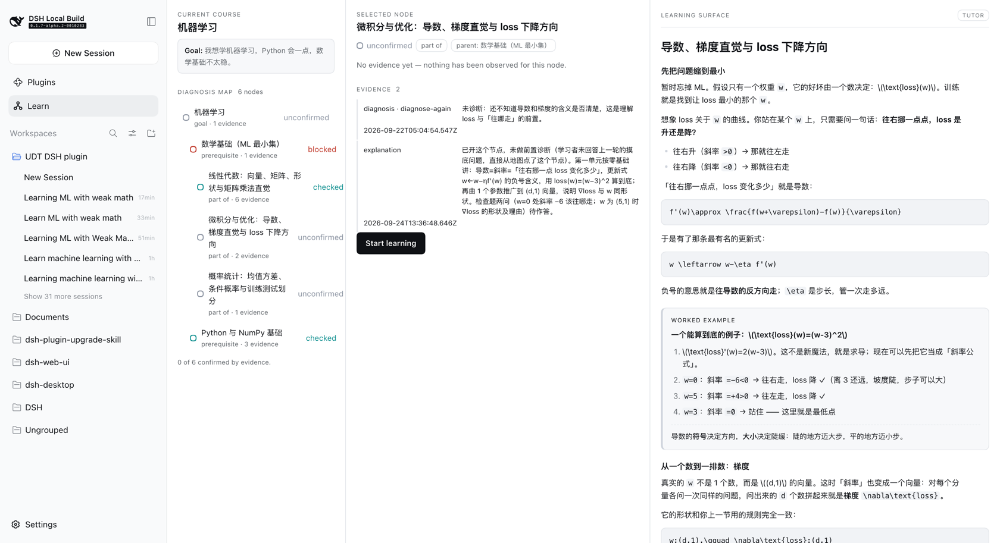
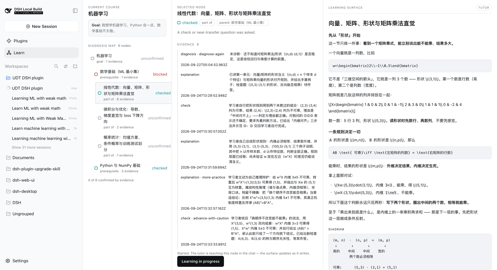
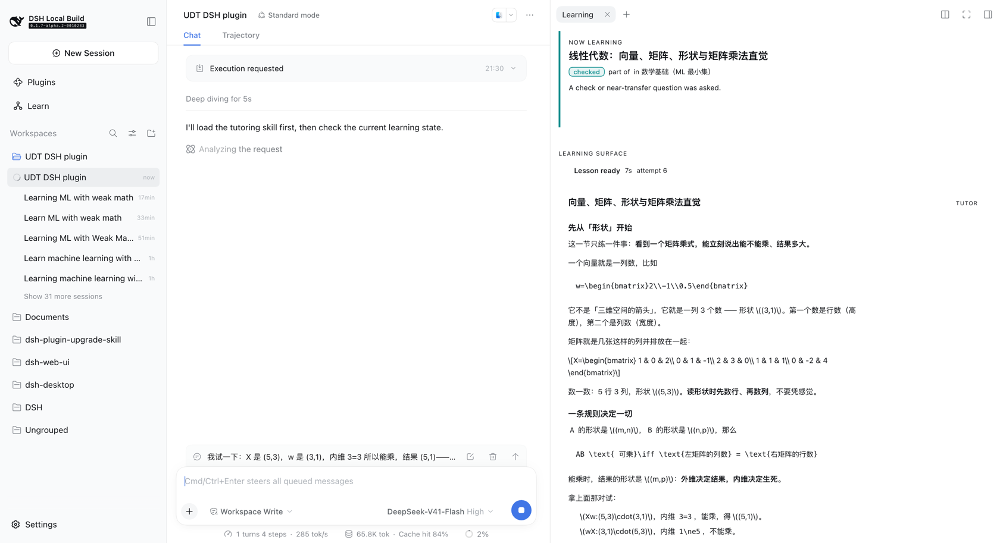

# Universal Diagnostic Tutor for DeepSeek Harness

> **From a Tutor Skill to a Learning Runtime.**

Diagnosis-first AI learning runtime for DeepSeek Harness — map what you need,
learn interactively, and move to the next best step.



<sub>The learning surface docked in the right sidebar, beside the conversation. The map, the lesson and the chat are on screen at once, so answering a check never means leaving the lesson.</sub>

## Early development

`v0.0.x`. The learning loop works end to end — a real goal, a real diagnosis
map, a tutor-written lesson, a check answered in the chat, recorded evidence,
and a next step the tutor chose — but this is not a finished product. Expect
breaking changes, and expect gaps to be documented rather than papered over.
Not built yet, and not claimed anywhere below: PDF or document ingestion, RAG,
flashcards, resource libraries, analytics, or course generation.

## Two halves, one system

The unusual thing about this project is that **the teaching and the runtime are
separate programs**, and only one of them makes decisions.

| | Owns | Where |
| --- | --- | --- |
| **[Universal Diagnostic Tutor](https://github.com/SenmuuuuW/universal-diagnostic-tutor-skill) skill**<br>= **the teaching brain** | What to teach next: diagnosis, teaching moves, pacing, when a check is passed, what the next step is | that repository (v2.1, MIT) |
| **`dsh-diagnostic-tutor`**<br>= **the learning runtime** | Where it is kept: persistent learner state, the diagnosis map, structured lessons, the UI | here |

That split is not a packaging detail. This repository contains **no teaching
logic**: no rule that says "if blocked, explain the prerequisite", no rule that
says "if wrong, give a simpler example". Those live in the skill. The runtime
stores what the tutor decided, shows it, and never decides it.

## The loop

```
Goal  →  Diagnose  →  Map  →  Learn  →  Check  →  Decide  →  Next lesson
 │                      │        │         │         │            │
 │                      │        │         │         │            └ the tutor names
 │                      │        │         │         │              the next node, with a reason
 │                      │        │         │         └ the learner answers in the chat
 │                      │        │         └ the tutor writes the lesson into the side panel
 │                      │        └ nodes appear only as diagnosis reveals them
 │                      └ the tutor asks what you actually know
 └ stated in your own words, in the chat
```

Read left to right, that is also the guarantee: **the runtime never advances on
its own.** A decision is stored with the tutor's reason, shown to the learner,
and waits to be pressed.

### The demo scenario

The screenshots below come from one scenario, run against real DeepSeek Harness
with the real skill:

> **I want to learn machine learning. I know some Python, but my math is weak.**

The tutor asks what the goal is *for* before it teaches anything, then grows a
map one diagnosis at a time.

Nothing in these images is a fixture or a mock — they are screenshots of the
running app. `demo-1` is a cold start from an empty store; the rest are the same
scenario resumed, because the clarify-then-diagnose phase costs several model
turns and a cold start to a full lesson runs to roughly fifteen minutes.

| | |
| --- | --- |
|  | **First use.** No goal yet. One question, and the sentence that answers it — no wizard, no empty dashboard. |
|  | **The diagnosis map.** Six nodes, each traceable to evidence, nested by depth. `blocked` and `checked` read at a glance; nothing is `confirmed` without a check behind it. |
|  | **A lesson.** Real headings and lists, a worked example set apart, a diagram in its own frame, and a check that hands the turn back to the learner. |
|  | **The docked surface.** The same loop in the right sidebar, with the handoff progress line (`Lesson ready 7s`) so a slow model turn reads as *working* rather than *broken*. |

---

## Why this is not just another AI tutor

Most "AI tutor" projects are a prompt wrapped around a chat box: the model
teaches, and nothing about the learner survives the conversation. Three things
are different here.

**The teaching brain is a real, separate artifact.** Diagnosis, teaching moves,
pacing and mastery judgement live in a written skill with its own protocols —
not in a system prompt this repository invented. This plugin depends on it and
refuses to duplicate it.

**State is real, and it is the learner's.** A goal, a map of what you actually
know, and a record of the evidence behind each status. Nothing is `confirmed`
without a check to back it, nothing is scored, and it is all visible and
exportable.

**The runtime does not decide.** The tutor names the next step and says why; the
runtime stores that and shows it; the learner presses Continue. There is no
path by which progress advances on its own.

Its state vocabulary is not invented here either: nodes carry the skill's own
seven status terms, and checks carry its six readiness outcomes.

### Why a map does not contradict diagnosis-first

The skill is explicit that a broad goal must **never** become a pre-expanded
curriculum or a course outline. This plugin does not produce one. Nodes appear
only as diagnosis reveals them, every node is `unconfirmed` until a check
produces evidence, and the map is reversible — new evidence moves it. What you
see is a *diagnosis map*, not a syllabus.

---

## Compatibility

A DSH profile can resolve **more than one harness version at once** (the running
host, the shared profile fallback, and each plugin's own store). Treat this
matrix as load-bearing, not decoration.

| This plugin | Verified against DSH | Node |
| --- | --- | --- |
| `0.0.9` | `0.1.7-alpha.2` (also composed under `0.1.5-rc.1`) | `^22.19.0 \|\| >=24.0.0` |

Rules this repository enforces mechanically:

- **Named exports only.** A `export default` plugin makes Cordis' loader prefer
  `.default` and **silently drop `inject`** — a documented DSH outage. Pinned by
  a test that fails if a default export is ever introduced.
- **`@deepseek-ai/*` is imported `type`-only**, so the compiler erases it and no
  second runtime copy can be resolved. Enforced by `verbatimModuleSyntax`, and
  verified on the built artifact (it contains zero imports).
- **No `instanceof` across package boundaries.** Take runtime objects from `ctx`.
- Peer ranges are wide (`<0.2.0`); dev dependencies pin one exact cohort.

---

## Install

> **There is no npm release yet.** Install from the repository; that is the only
> path until `v0.1.0`.

**Requirements**

| | |
| --- | --- |
| [DeepSeek Harness](https://github.com/deepseek-ai/deepseek-harness) | verified against `0.1.7-alpha.2` |
| Node | `^22.19.0 \|\| >=24.0.0` |
| pnpm | for the build, and because `dsh plugin` forwards to it |
| the [Universal Diagnostic Tutor](https://github.com/SenmuuuuW/universal-diagnostic-tutor-skill) skill | the teaching brain. Without it the runtime loads and records state, but **no lesson is ever written** — and it says so, in the log and in the panel |

**Install**

```sh
git clone https://github.com/SenmuuuuW/dsh-diagnostic-tutor
cd dsh-diagnostic-tutor
pnpm install
pnpm build

# --profile is mandatory: `dsh plugin` without it exits non-zero, because it is
# a thin pnpm forwarder that needs a profile to forward into.
#
# Use an absolute path. `dsh plugin` runs pnpm inside the profile directory, so
# a relative path would resolve against the profile, not your checkout.
dsh plugin --profile <profile> add "$PWD"
```

**Verify it mounted**

```sh
# The plugin should appear in the merged tree, as an insert row.
dsh --profile <profile> --dump-config | grep -A2 dsh-diagnostic-tutor
```

Then start the profile with a web surface and look for **Learn** in the sidebar:

```sh
dsh <profile> --port 8399 --no-open
```

A `--dump-config` entry only proves a loader row exists — it is not proof the
plugin runs. For that, open the panel: a first run shows *What do you want to
learn?*, and a profile with no skill shows the no-tutor notice instead.

**Known install limitation.** A `github:` install also requires approving the
package's build script in the profile's `pnpm-workspace.yaml`, which is
permission for that code to run on your machine at install time. Prebuilt
artifacts remove this step, and are the intent from `v0.1.0` onward.

---

## Learner state and the diagnosis map

State lives in one Cordis **storage domain** (`udt`, version 1) over the
official `storageDomain` seam. The profile chooses the medium — the standard
profiles route it through `dsh-storage-json` under `dshHomePath('storages')` —
so this plugin never hardcodes a path.

With the json backend you get exactly one document, `<storage root>/udt.json`
(`~/.dsh/storages/udt.json` for a default install):

```json
{
  "unit": { "name": "udt", "version": 1 },
  "global": { "initializedAt": "…", "updatedAt": "…", "activeCourseId": "…" },
  "tables": { "courses": { "…": {} }, "nodes": { "…": {} } }
}
```

| Slot | Holds |
| --- | --- |
| `global` | the learner singleton — preferences, active goal, `initializedAt` |
| `tables.courses` | one record per learning goal, in the learner's own words |
| `tables.nodes` | the diagnosis map: `id`, `courseId`, `title`, `parentId?`, `relation`, `state`, `evidence[]` |

Two deliberate rules:

- **zod is the contract.** Every record is validated at the durable boundary, so
  a hand-edited or corrupt document fails loudly instead of entering memory.
- **No scores, ever.** There is no field for points, grades or percentages —
  the skill forbids turning mastery into a score, and a test asserts that no
  such key exists anywhere in the persisted document.

Records are never mutated in place; writes go through `put`/`set` on one
per-domain write chain, so concurrent writers cannot interleave.

### How the map is kept from becoming a syllabus

The rules are enforced in `src/diagnosis.ts` as pure functions, so no tool can
route around them:

- a node is **born `unconfirmed`**, and stays there without evidence;
- `confirmed` requires a **`check` or `transfer`** evidence entry. Explanation
  or practice alone never confirms — the skill is explicit that "explanation
  alone and one lucky answer never confirm readiness";
- a **goal node can never be confirmed**: it is the frame of the map, not a
  claim about the learner;
- every non-goal node must attach to a **parent that already exists** in the
  same course, and there are no cycles — so the map grows outward from what has
  been diagnosed, one step at a time;
- **at most 8 nodes per call and 40 per course.** A single call cannot plant a
  term's worth of material;
- `relation` is `goal | part-of | prerequisite | related`. There is deliberately
  no `next-in-course`, because nothing in this runtime knows a teaching order.

### Tools

Five, and none of them decides anything about teaching.

| Tool | Does |
| --- | --- |
| `udt_status` | reports the runtime: domain, version, goals, map, **and the current focus** |
| `udt_goal_create` | records a goal and plants the map root — and nothing else |
| `udt_map_get` | reads the map with each node's relation, state and evidence |
| `udt_map_update` | `add-nodes` · `set-state` · `add-evidence` |
| `udt_lesson_update` | writes teaching into the learning surface as blocks |
| `udt_decide_next` | records where the learner should go next, and why |

The division is the architecture: the tutor decides **what** to teach, when to
check, and what an answer showed; the runtime decides **what may be stored** and
renders it. There is no branch anywhere in this repository that says "if blocked
then explain the prerequisite" — that is the skill's call, made in the chat.

### The loop

```
press Start learning
   → focus recorded (courseId, nodeId, startedAt, status)
   → the tutor is woken in that conversation with the node named
   → the tutor teaches into the surface via udt_lesson_update
   → the learner answers the check in the chat
   → the tutor judges, records evidence via udt_map_update, decides the next move
   → the panel follows
   → the tutor decides the next step with udt_decide_next
   → the panel shows the recommendation and its reason
   → the learner presses Continue, and the next node begins
```

### The decision

`action` is the skill's six readiness outcomes, reused rather than re-invented:
the words for "what this concept showed" and "where that sends the learner" are
the same words. The runtime only needs one structural fact about each — whether
it names a target:

| outcome | target | means |
| --- | --- | --- |
| `advance` / `advance-with-caution` | required | move there |
| `step-down` | required | the blocker; usually a prerequisite |
| `review-first` | optional | go back, or review here |
| `more-practice` / `diagnose-again` | forbidden | stay here |

A move ends the focus and stamps `endedAt`; staying leaves it open. Nothing
moves on its own — the learner reads the reason and presses Continue.

### The wait, measured

Moving to a node is not instant, so the wait is a **persisted record** keyed by
target node — which makes it idempotent, refresh-proof, restart-proof and
retryable — and it carries a timestamp per stage:

```
requestedAt → focusRecordedAt → promptedAt → firstActivityAt → lessonAt → observedAt
```

The same record is the progress line (`focus recorded` → `tutor requested` →
`tutor working` → `lesson ready`, with elapsed seconds) and the measurement. A
real run against DSH 0.1.6-alpha.2 and the real skill:

| stage | when |
| --- | --- |
| focus persisted | 0.0s |
| followup accepted | 0.0s |
| first tutor activity | 1.0s |
| lesson written | 26.1s |
| UI observed | 26.1s |

**The plugin costs about a second; the rest is the model writing.** A stall is
derived from the record rather than stored, and retrying never touches the
focus — a timeout is a statement about the wait, not about where the learner is.

`Start learning` is a **user-role turn attributed to this plugin**, not injected
context: `agent.inject()` would add model-visible context without waking an idle
agent, so nothing would happen until the learner typed. Opening a turn is what
the button means.

### Two surfaces, one state

| Surface | Where | For |
| --- | --- | --- |
| **Learning tab** | right sidebar, beside the chat | everyday work — map, node and lesson while you talk |
| **Learning panel** | the main column (`main`) | focus mode — the whole runtime at once |

The tab is the reason the loop is usable: the full panel fills the main column,
which is also where the conversation lives, so with only that panel answering a
check meant leaving the lesson. The right sidebar is a separate column.

Both run on one shared `useLearning` state, so they cannot disagree about what
is focused or what the tutor wrote. The panel's **Answer in the chat** button
returns to the conversation and docks the tab in the same step.

The right sidebar hosts session-scoped tabs, so it can only accept one while a
session surface is mounted — which is why docking happens on the way back to the
conversation rather than at load.

### Teaching-brain detection

At load the plugin asks the platform's own skill registry whether the
Universal Diagnostic Tutor skill is installed — no path is hardcoded, no skill
root is assumed, and nothing is copied. A missing catalog, a missing skill and
an unreadable body each degrade to a reported status rather than an error.

Compatibility is probed by **capability**, not by a version string: the skill's
maintenance contract permits only `name` and `description` in frontmatter, so
it cannot declare a version. The result carries a short content digest as a
version hint.

Detection results stay **internal** — logged at `debug`, absent from every tool
output. The skill forbids naming its files, versions or repository in
learner-facing text, and this runtime will not be what leaks them.

### How the two halves agree

The skill's guardrails say mastery tracking must never become "scores,
databases, hidden memory, or a curriculum roadmap", while this runtime
deliberately persists state and renders a map.

Until `v0.0.8` that tension was bridged from this side: a short system-prompt
section explained the runtime's storage semantics to the teaching brain. UDT
v2.1's `learning_runtime_contract.md` now states all of it in the skill's own
words — what a runtime may hold, when a decision is recorded, and that a turn
which judged an answer is *not finished* until the next step is recorded — so
the bridge was **deleted rather than kept as a second voice**. The plugin got
better at it, which is the evidence it belonged upstream.

## The panel

The browser half registers two things and nothing else: a sidebar icon
(`sidebar.panellist`, a `list`) and the page it opens (`main`, a `keyed` slot).
The sidebar `id` and the panel `key` come from one constant — a drift between
them would leave the icon opening nothing.

It reads as one sentence, left to right:

```
[ Course + Diagnosis Map ]  →  [ Selected node ]  →  [ Learning surface ]
```

There is no dashboard: three panes, and the map is the navigation.

### Learning Blocks

A block is `{ id, type, content, metadata? }`. The **schema is host-side**
(zod-validated at the durable boundary) and the **renderers are browser-side**,
keyed by `type`:

| Type | Content |
| --- | --- |
| `text` | `md` — markdown, with the skill's `\(...\)` math convention |
| `example` | `title`, `steps[]`, `takeaway?` |
| `diagram` | `format` (`ascii` \| `mermaid`), `spec`, `caption?` |
| `check` | `prompt`, `expect?`, `hint?` — the stop-and-wait surface |

Adding Formula, Code, Comparison, Practice or Resource later means adding one
registry entry, never rewriting the lesson renderer. An **unknown type renders a
readable placeholder** rather than throwing, so a lesson authored by a newer
host still renders here.

### Browser API

Three calls, at `/diagnostic-tutor/api`:

| Route | Returns |
| --- | --- |
| `GET /overview` | the current course and its whole map (`course: null` on a first run) |
| `GET /node?id=` | one node with its evidence, parent and children |
| `POST /lesson {nodeId}` | the prototype lesson, built once and reused after that |

Every request passes a **trust fence**: a bare `ctx.webServer.register()` route
inherits no authentication, so the route checks that the request arrived at a
loopback `Host`, from a loopback `Origin`, and is not marked cross-site. Anything
else gets `403` and no body. The browser receives **views only** — no storage
path, no domain handle, no raw record.

## Preview

The panel takes its API as a prop, so the UI runs with no DSH and no agent:

```sh
pnpm build && pnpm preview     # then open the printed URL
```

`preview/index.html` loads the **real built bundle** through a
`__ModuleLoader__` shim over `preview/fixture.js`, which models a learner who
said "I want to learn machine learning" with shaky maths:

```
Machine Learning            [goal, unconfirmed]
├─ Math Foundations         [prerequisite, blocked]
│  ├─ Linear Algebra        [part-of, unconfirmed]
│  ├─ Calculus              [part-of, unconfirmed]
│  └─ Probability           [part-of, unconfirmed]
└─ Python                   [prerequisite, unconfirmed]
```

To capture the panel from a *live* profile instead:

```sh
pnpm screenshot "<dsh-url-with-token>" preview/dsh-ui.png
```

## Development

```sh
pnpm install
pnpm typecheck   # tsc --noEmit  (host and client)
pnpm test        # 241 tests: unit, guard, DOM, render, real composition
pnpm build       # tsc -> lib/ (host) + tsdown -> lib/client.js
```

`tests/harness.ts` mounts the **same storage stack the standard profiles use**
(`systemPrompt` → `tools`, and `storage` → `storage-json` → `storage-domain`)
over a temporary root. Persistence tests therefore exercise a real
serialize → file → reparse → validate round trip rather than a fake, and
`--dump-config` is never mistaken for proof that a plugin loads: that only
shows a loader row exists.

## Roadmap

| Version | Ships |
| --- | --- |
| `v0.0.1` | installable bundle, plugin loads, guard + composition tests |
| `v0.0.2` | `udt` storage domain, learner round-trip, `udt_status` tool |
| `v0.0.3` | teaching-brain detection, `udt_goal_create`, the diagnosis map (`udt_map_get` / `udt_map_update`) |
| `v0.0.4` | the client half: slot-mounted panel, clickable map, node detail, Learning Blocks, browser API |
| `v0.0.5` | the loop: learning focus, tutor-written lessons, check → evidence → state, live panel |
| `v0.0.6` | the learning surface docks beside the chat; both surfaces share one state |
| `v0.0.7` | the tutor decides the next step; focus lifecycle; NEXT BEST STEP card |
| `v0.0.8` | handoff record, progress line, retry, and the latency measured |
| `v0.0.9` | **current** — DSH 0.1.7 compatibility, the first real A → B, and product polish |
| `v0.1.0` | **first playable MVP** — state export/reset, settings, i18n, math typesetting |

## Trust

DSH does not sandbox plugin code: an installed plugin runs in-process with your
privileges, and a bare `ctx.webServer.register()` route inherits no
authentication. This plugin's commitments:

- reads and writes only its own storage domain;
- serves its browser half only from loopback-fenced routes it checks itself;
- makes no outbound network requests;
- writes no files outside the harness's own storage;
- keeps learner state visible, exportable and deletable — never hidden memory.

## License

MIT. The Universal Diagnostic Tutor skill is a separate MIT project by the same
author and is not vendored here.

Planning and architecture research for this project live in
[`docs/planning/`](docs/planning/).
